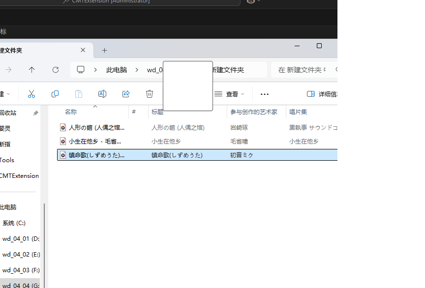
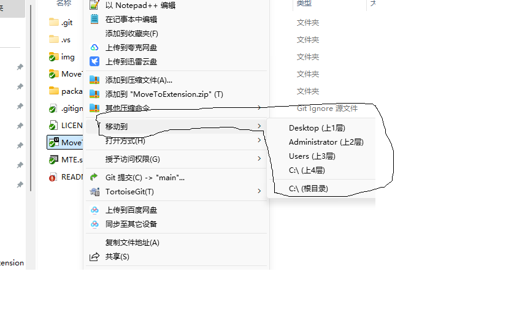
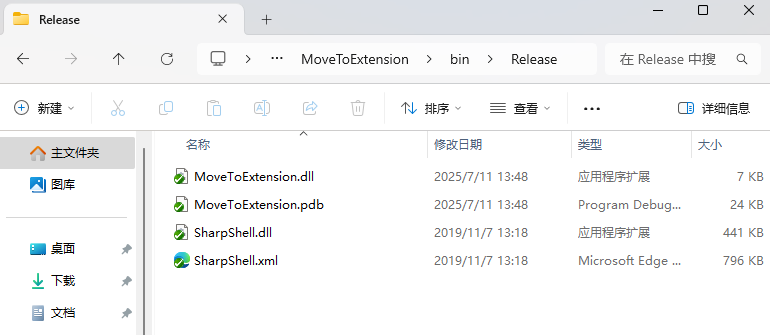
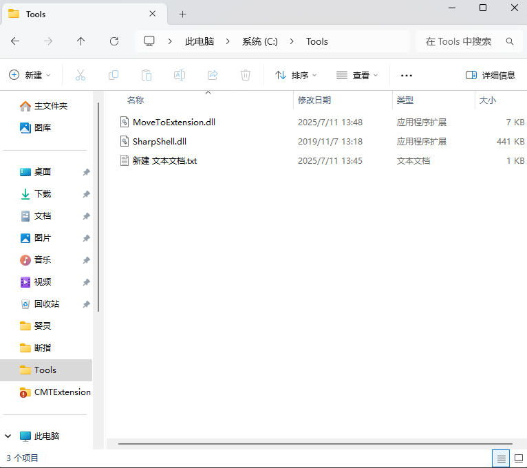
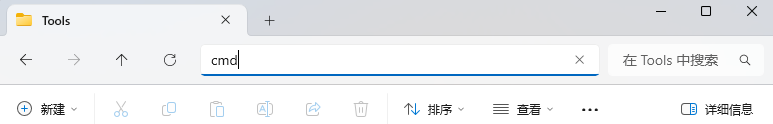
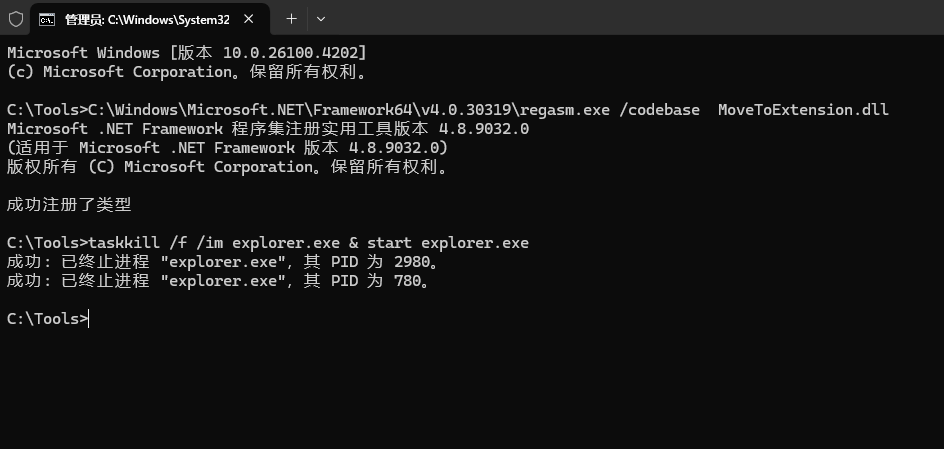
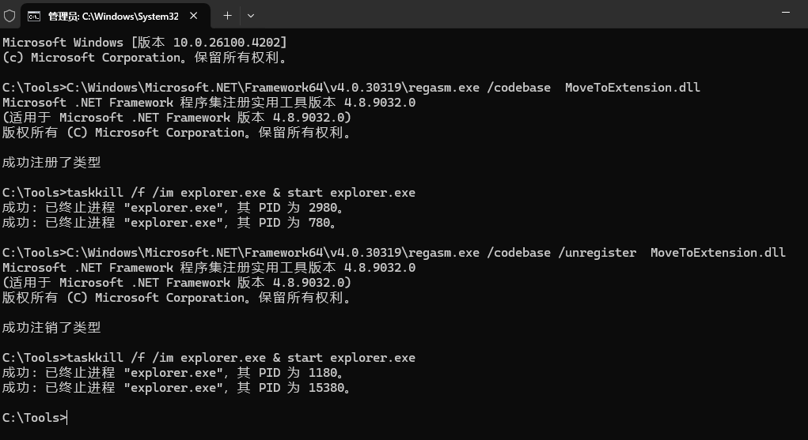
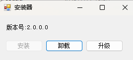
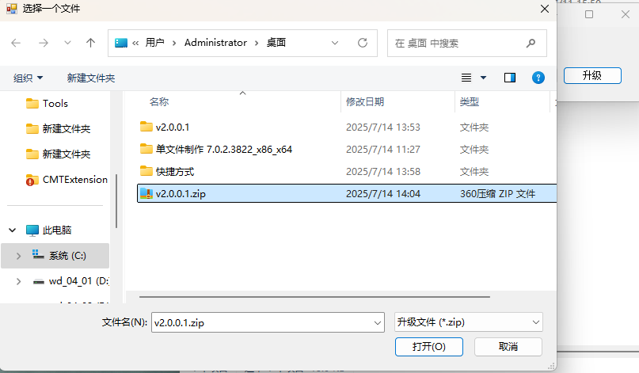

# CMTExtension
1
# 目标
win11 系统把原先文件拖动到地址栏移动文件的方式给他去掉了，这就导致我在使用的过程中非常不舒服
为此我找了许多方法例如StartAllBack等，感觉这些都太重了
鉴于此，专门做了这一个工具

# 方案
增加一个右键菜单，名为移动到 ，移动到增加一系列二级菜单 表示每一层级的文件夹

# 使用教程
安装：
1.将MoveToExtension\Release里面的内容复制一份到c盘某英文文件夹下，比如tools文件夹

2.然后在地址栏搜索cmd回车打开cmd

3.输入”regasm.exe /codebase  MoveToExtension.dll” 回车，显示 成功注册了类型 

4.然后输入”taskkill /f /im explorer.exe & start explorer.exe” 这时窗口会闪烁下

5.这时看下右键，如果出现移动到 就表示安装完成

    出错情况：

    输入”regasm.exe /codebase  MoveToExtension.dll” 回车，显示 `'regasm' 不是内部或外部命令,也不是可运行的程序

        32位系统

            去C:\Windows\Microsoft.NET\Framework\v4.0.30319找下有没有regasm.exe文件，如果没有这个文件甚至v4.0.30319这种类似的文件夹，就去程序与功能这边重新安装.net framework

            如果有这个文件，就在cmd里运行输入”C:\Windows\Microsoft.NET\Framework\v4.0.30319\regasm.exe /codebase MoveToExtension.dll” 回车，会显示 成功注册了类型 

            然后进行4，5两步

        64位系统
            去C:\Windows\Microsoft.NET\Framework64\v4.0.30319找下有没有regasm.exe文件

            如果没有这个文件甚至v4.0.30319这种类似的文件夹，就去程序与功能这边重新安装.net framework

            如果有这个文件，就在cmd里运行输入”C:\Windows\Microsoft.NET\Framework64\v4.0.30319\regasm.exe /codebase  MoveToExtension.dll” 回车，会显示 成功注册了类型 

            然后进行4，5两步

        注意：64位系统，不要用Framework里的，要用Framework64里的

卸载

1.然后在地址栏搜索cmd回车打开cmd

2.输入”regasm.exe /codebase /unregister  MoveToExtension.dll” 回车，显示 成功注销了类型 

3.然后输入”taskkill /f /im explorer.exe & start explorer.exe” 这时窗口会闪烁下

4.这时看下右键，如果不出现移动到 就表示卸载完成

regasm 不是内部或外部命令,也不是可运行的程序 问题 同安装

安装器安装：
    安装：双击打开MTEInstaller.exe，点击安装，等待安装成功
    升级：双击打开MTEInstaller.exe，点击升级，等待安装跳出升级包选择框，选择版本包，等待安装成功
    卸载：双击打开MTEInstaller.exe，点击安装，等待卸载成功
    

# 采用技术
程序集注册 动态右键菜单 SHFileOperation

# 第三方依赖库
SharpShell

# 后期可优化方向
日志
常用文件夹支持
网络